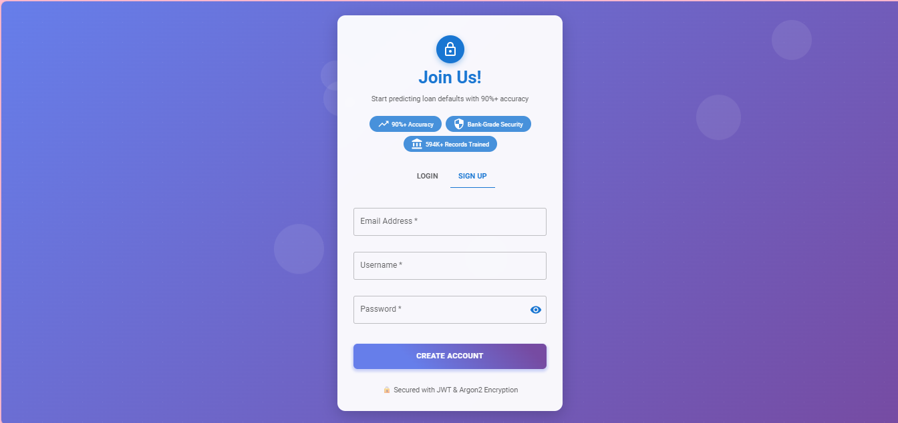
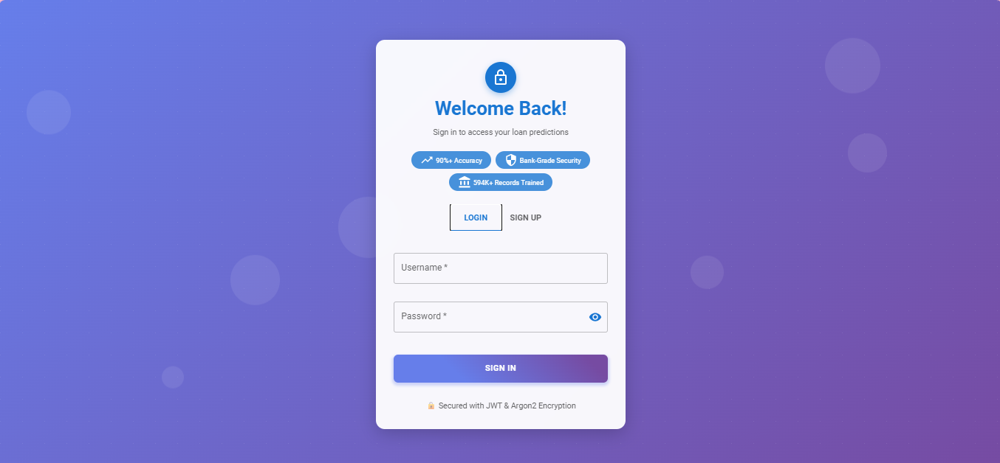
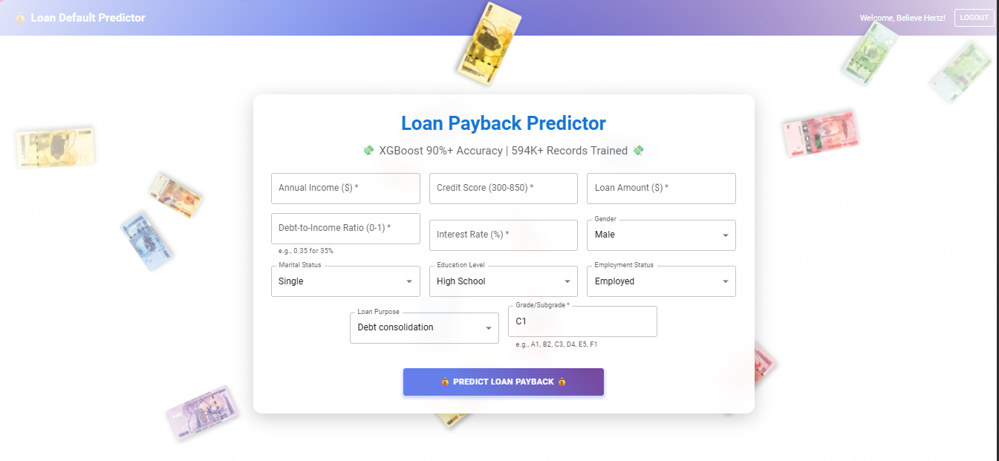

# 🏦 Loan Default Predictor

[](https://loan-default-predictor-one.vercel.app/)
[](https://loan-default-predictor-q8ne.onrender.com/docs)
[](https://python.org)
[](https://reactjs.org)

> AI-powered loan risk assessment with 90.13% accuracy using XGBoost and 594K+ real loan records.


**Signup Page:**


**Login Page:**


**Prediction Form:**


**Results:**


## 🚀 Live Demo

- **Frontend (Vercel):** [https://loan-default-predictor-one.vercel.app/](https://loan-default-predictor-one.vercel.app/)
- **Backend API (Render):** [https://loan-default-predictor-q8ne.onrender.com/docs](https://loan-default-predictor-q8ne.onrender.com/docs)

## ✨ Features

- 🔐 **JWT Authentication** - Secure login/signup with Argon2 password hashing
- 🤖 **ML Prediction** - XGBoost model with 90%+ accuracy
- 💸 **Animated UI** - Real Ugandan Shilling (UGX) banknotes falling in background
- 📱 **Responsive Design** - Works on mobile, tablet, and desktop
- 🔒 **Bank-Grade Security** - HTTPS, CORS protection, input validation
- 📊 **Prediction History** - Track your past loan assessments

## 🏗️ Architecture

┌─────────────┐ HTTPS ┌─────────────┐ SQL ┌─────────────┐ │ React │ ◄──────────────► │ FastAPI │ ◄────────────► │ PostgreSQL │ │ (Vercel) │ │ (Railway) │ │ (Railway) │ └─────────────┘ └─────────────┘ └─────────────┘ │ ▼ ┌─────────────┐ │ XGBoost │ │ Model │ │ (90.13% acc)│ └─────────────┘


## 🛠️ Tech Stack

### Frontend
- **Framework:** React 18 + TypeScript
- **Build Tool:** Vite
- **UI Library:** Material-UI (MUI) v5
- **HTTP Client:** Axios
- **Animation:** CSS Keyframes
- **Auth:** JWT (jsonwebtoken)

### Backend
- **Framework:** FastAPI (Python)
- **ML Library:** XGBoost, Scikit-learn, Pandas
- **Database:** PostgreSQL + SQLAlchemy ORM
- **Auth:** JWT (python-jose) + Argon2 (passlib)
- **Validation:** Pydantic v2

### Infrastructure
- **Frontend Hosting:** Vercel (Edge Network)
- **Backend Hosting:** Render (Docker)
- **Database:** Render PostgreSQL
- **CI/CD:** GitHub → Auto-deploy

## 📋 Prerequisites

- Node.js 18+
- Python 3.11+
- PostgreSQL 15+ (or Docker)
- Git

## 🚀 Local Development

### 1. Clone Repository
```bash
git clone https://github.com/believehertz/loan-default-predictor.git
cd loan-default-predictor
